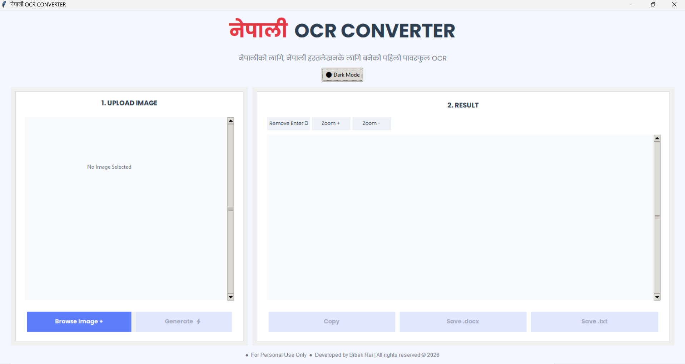

# 🇳🇵 Nepali OCR Converter

A powerful desktop application to extract text from images and PDFs (via images) with high accuracy, **including handwritten Nepali documents**. Built with Python, Tkinter, and Google Lens API.

  <!-- Add a screenshot later -->

## ✨ Features

- 🖼️ Extract text from images (JPEG, PNG) – scanned documents, photos, screenshots.
- ✍️ **Handwritten Nepali support** – converts handwritten documents into editable text.
- 🌓 Light/Dark theme – easy on the eyes.
- 🔍 Zoom in/out on extracted text.
- 📋 Copy to clipboard.
- 💾 Save as `.txt` or `.docx`.
- 🛡️ Privacy warning & rate limiting to protect your data.
- 🔌 Optional proxy support for advanced privacy.

## 🚀 How to Run (for developers)

### Prerequisites
- Python 3.8 or later
- pip

### 1. Clone the repository
```bash
git clone https://github.com/BibekRai-np/Nepali_OCR
cd nepali-ocr
